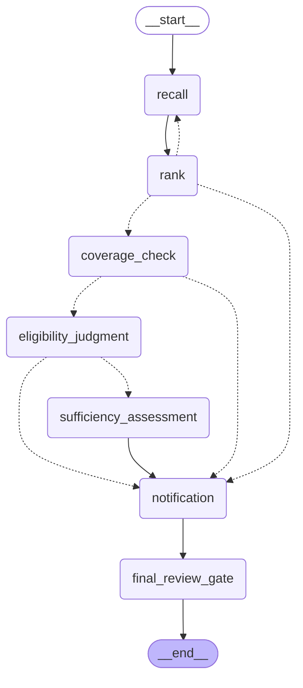

# Architecture

This document describes the triage pipeline. The diagram below is regenerated directly from the compiled LangGraph via `just diagram` (`graph.get_graph().draw_mermaid()`, written to `docs/graph.mmd`), so it can never silently drift from the code.

As of ticket 05, the graph implements Recall, Rank, Coverage Check, Eligibility Judgment, Sufficiency Assessment, Notification, and the Final Review Gate, plus the Broadening loop between Recall and Rank (tc001's clean match, tc002's fuzzy match). The Policy Selection Gate (ticket 06) still routes through the same shape: today, multiple ambiguous candidates or an exhausted Broadening budget route straight to Notification → Final Review Gate.

## Pipeline

Every LLM-produced node output is validated at the model boundary via `with_structured_output` against a Pydantic schema — a malformed response is a validation error where it occurs, not a parsing bug three steps downstream.

## Data model

**Policy**: `policy_id`, `holder_name`, `phone`, `dob`, `address`, `product_type`, `coverage_start`, `coverage_end`, `coverage_limit`, `status`.

**Claim**: `claim_id`, `policy_id_provided`, `claimant_name`, `claimant_phone`, `incident_date`, `description`, `requested_amount`, `documents[]` (each `{doc_type, filename, present}` from a fixed enum — never fake file content, see [ADR-0004](docs/adr/0004-documents-as-metadata.md)).

Scope is single-line (auto insurance only) — see [CONTEXT.md](CONTEXT.md) for the precise definitions of Policy, Claimant vs. Policy Holder, and every other domain term used above.

## Policy resolution

Recall and Rank are two distinct steps by design: Recall (LLM) optimizes for *finding* every plausible candidate from possibly messy input; Rank (deterministic) optimizes for *scoring* those candidates precisely, using weighted Jaro-Winkler name similarity, Metaphone phonetic matching, exact phone match after canonicalization, and exact DOB match, summed and compared against a configurable threshold. A Perfect Score (exact `policy_id` + exact name) resolves without a human gate; anything else ambiguous goes to the Policy Selection Gate.

If nothing clears the threshold, the search retries up to three times via a fixed broadening sequence rather than LLM-directed retry — see [ADR-0001](docs/adr/0001-deterministic-broadening.md). Exhausting all attempts routes straight to the Final Review Gate.

## Eligibility

Deliberately two outputs, never one blended verdict: a deterministic Coverage Check (does the requested amount and incident date fall within the policy's limit and coverage window) and a separate LLM Eligibility Judgment against a versioned Markdown guideline document (`prompts/guidelines/eligibility.md`, owned by the agent's configuration, never supplied by the claimant). See [ADR-0002](docs/adr/0002-eligibility-split.md).

## Human-in-the-loop

Two interrupt points — Policy Selection Gate and Final Review Gate — both implemented via LangGraph's `interrupt()` against a **Postgres-backed checkpointer**, so a paused run survives a process restart rather than only living for the lifetime of one running process. See [ADR-0003](docs/adr/0003-postgres-checkpointer.md).

The Policy Selection Gate shows the human the full candidate breakdown (all fields, per-candidate Rank Score, which fields matched/mismatched) rather than a bare list of IDs — the point of doing the ranking work deterministically up front is to hand the human something legible, not to make them repeat the matching by eye.

The Final Review Gate is terminal: the agent presents Policy Resolution confidence, Coverage Check result, Eligibility Judgment, and Sufficiency Assessment side by side (clearly distinguishing deterministic facts from LLM judgments), plus a drafted Notification. Approval writes the Notification to `data/output/` as plain text; rejection ends the run. No edit-and-resubmit loop — out of scope for a POC.

## Model access and caching

LLM calls are routed through model tiers (`model_fast`, `model_reasoning`) rather than hardcoded model names, selected per task by how much judgment it requires (recall search and document sufficiency use `model_fast`; eligibility judgment and the final summary/notification drafting use `model_reasoning`). A factory function maps the tier to a concrete LangChain chat model based on `LLM_PROVIDER` (`groq` or `openrouter`), so swapping providers is a `.env` change, not a code change.

Every model call goes through a single `cached_invoke` choke point: the response is cached in Postgres keyed by `sha256(model_id + rendered_prompt + output_schema_name)`, with no TTL (a content-addressed key can't go stale — a changed prompt, model, or schema simply produces a new key). Every call — hit or miss — still creates a Langfuse generation span, tagged `cache_hit: true/false`, so a trace shows the pipeline's real shape either way.

## Observability

Each end-to-end run is a single Langfuse trace (named by claim or scenario ID), with every node's LLM call nested inside it as a span. Transient provider failures (rate limits, timeouts) retry a few times with backoff; if still failing, the run fails loudly rather than being disguised as a "couldn't determine" outcome reaching the human as if it were a normal judgment call.

## Decisions and trade-offs

The reasoning behind the decisions above that were genuinely non-obvious or hard to reverse is recorded as ADRs rather than left implicit:

- [0001 — Deterministic broadening instead of LLM-directed retry](docs/adr/0001-deterministic-broadening.md)
- [0002 — Eligibility reported as two fields, never blended](docs/adr/0002-eligibility-split.md)
- [0003 — Postgres-backed checkpointer for durable human-in-the-loop gates](docs/adr/0003-postgres-checkpointer.md)
- [0004 — Submitted Documents as structured metadata, never fake file content](docs/adr/0004-documents-as-metadata.md)
