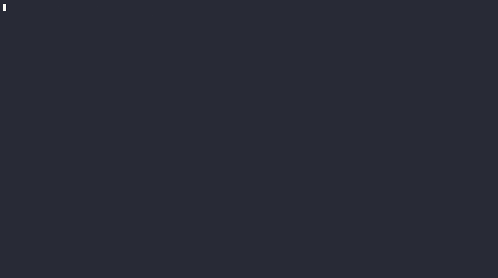
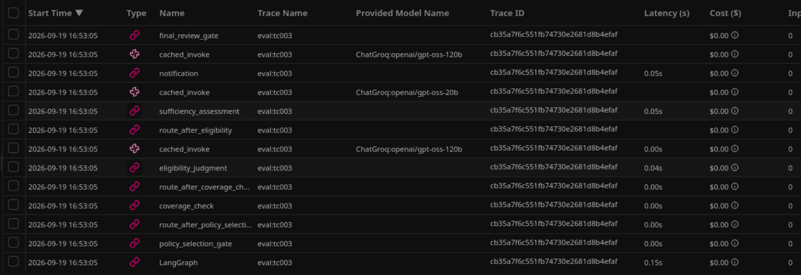

# Demo

Proof that the pipeline described in [README.md](../README.md) and the
[architecture](../ARCHITECTURE.md) actually runs, rather than just claims
to. Each artifact here is linked to (or a small excerpt embedded in) the
relevant blog post; this page is the canonical, full-detail source.

Artifacts are generated locally — see
[.scratch/demo-capture](../.scratch/demo-capture) for the scripts — and
committed under `docs/demo/`.

## End-to-end run: ambiguous match (tc003)

Exercises LLM-driven Recall, deterministic Rank Score, and the Policy
Selection Gate — the core LLM/deterministic/human split the project
argues for.



The gate hands two ambiguously-scored candidates to a human, who picks
`POL-00041`; the run then proceeds through Coverage Check (deterministic),
Eligibility Judgment and Sufficiency Assessment (LLM), and drafts a
notification:

```
[POL-00041] score=0.300
  holder_name: Jordan Ellison  (match)
  phone:       212-555-0141  (mismatch)
  ...
[POL-00042] score=0.300
  holder_name: Jordan Ellison  (match)
  phone:       212-555-0142  (mismatch)
  ...
(scripted response: POL-00041)

[LLM judgment] Eligibility Judgment
  eligible:  True
  rationale: The policy is active, the incident (a side‑mirror damaged by
  a shopping cart) falls under the Comprehensive coverage type...

Scenario tc003 complete. Final decision: approve
```

Full transcript: [`docs/demo/tc003-transcript.txt`](demo/tc003-transcript.txt).
Raw asciinema recording (source for the GIF above):
[`docs/demo/tc003-hero.cast`](demo/tc003-hero.cast).

## Contrasting branch: ineligible claim (tc005)

The Eligibility Judgment branch — see
[ADR-0002](adr/0002-eligibility-split.md) for why this is reported
separately from the deterministic Coverage Check rather than blended into
one verdict.

Here Coverage Check fails deterministically (requested amount exceeds the
policy limit) before Eligibility Judgment or Sufficiency Assessment ever
run:

```
[deterministic fact] Coverage Check
  within coverage limit:  False
  within coverage window: True

[LLM judgment] Eligibility Judgment
  not assessed

[LLM judgment] Sufficiency Assessment
  not assessed
```

Full transcript: [`docs/demo/tc005-transcript.txt`](demo/tc005-transcript.txt).

## Observability: model tiering, caching, tracing

A real Langfuse trace showing per-step model tier, a cache hit (zero
token usage), and cost.



Traces are named `triage:<claim_id>` (ticket 01) and `just eval`'s
drift-check calls nest under one `eval-drift:<scenario_id>` trace per
Scenario instead of surfacing as standalone `cached_invoke` traces (ticket
02) — both fixes are visible in the trace tree above.

## Durable human-in-the-loop gates (ADR-0003)

The Policy Selection Gate persisted in Postgres survives the process that
hit it dying — a second, independent process resumes the same thread and
completes the run. Captured as a transcript rather than a GIF, since the
interesting part (state surviving a process boundary) isn't visual.

```
--- PAUSED at gate 'policy_selection'. ---
Process exiting now, as if it crashed or was killed mid-review.
Run: uv run python .scratch/demo-capture/pause_phase2.py POL-00041

    (process has exited — state is now only in Postgres, not memory)

Resumed thread 'tc003' in a fresh process.
Final decision: approve
```

Full transcript: [`docs/demo/pause-resume-transcript.txt`](demo/pause-resume-transcript.txt).
As noted in `.scratch/demo-capture/README.md`, there's no `just resume
<thread_id>` command yet — this was captured by driving `build_graph`/
`get_checkpointer` directly (`pause_phase1.py` / `pause_phase2.py`) to
force a real cross-process resume, not `just run`'s single-process
interrupt loop.

## Eval drift check (ticket 18)

`just eval` re-runs each Scenario's judgment steps against recorded
golden outputs and flags drift. Not a production eval framework — see
the write-up in the architecture blog series' third post for what a real
one would need beyond this.

```
[tc001] OK — eligibility_judgment, sufficiency_assessment match golden output
[tc002] OK — eligibility_judgment, sufficiency_assessment match golden output
[tc003] OK — eligibility_judgment, sufficiency_assessment match golden output
[tc004] skipped
[tc004] note: no Policy resolved or Coverage Check failed — Eligibility Judgment never runs
[tc005] skipped
[tc005] note: no Policy resolved or Coverage Check failed — Eligibility Judgment never runs
[tc006] OK — eligibility_judgment, sufficiency_assessment match golden output

No drift detected.
```

Full output: [`docs/demo/eval-output.txt`](demo/eval-output.txt).
